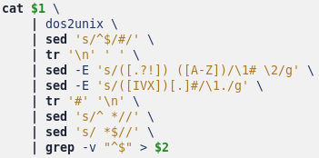

## Command-Line Tools for Linguists, Fall 2021

 This course familiarizes the student with several Unix commands that are useful in processing text. I summarize here the commands in chronological order.

### Week 1
An introduction to command-line environments. Basics of file manipulation: `ls`, `cd`, `wget`, `less`, `cat`, `touch`, `rm`, `mkdir`, `rmdir`, `cp`, `mv`. Choosing an editor.

### Week 2
Being a user of a Unix system. More advanced operations on files using `chmod` and `ln`. Processes, `ps`, `kill`. Remote login via SSH.

### Week 3
Corpus processing, part 1 of 2. Piping and redirection. Text encodings, line endings, counting, sorting: `cat`, `tr`, `head`, `tail`, `wc`, `cut`.

### Week 4
Corpus processing, part 2 of 2. Regular expressions and `sed`. This week introduces intermediate text formats that are useful in corpus processing:
 - Frequency list
 - Sentence-per-line format
 - N-gram list

### Week 5
Shell scripts. Special shell scripts that act as configuration files: `.bashrc`, `.bash_profile`.
```
#!/bin/bash
# Converting a text file to sentence-per-line format.
# Handle the occasional Roman numeral and the following period without
# introducing a line break there.
cat $1 \
	| dos2unix \
	| sed 's/^$/#/' \
	| tr '\n' ' ' \
	| sed -E 's/([.?!]) ([A-Z])/\1# \2/g' \
	| sed -E 's/([IVX])[.]#/\1./g' \
	| tr '#' '\n' \
	| sed 's/^ *//' \
	| sed 's/ *$//' \
	| grep -v "^$" > $2

```

### Week 6
How to install programs. Package managers, and the basics of `make`.

### Week 7
Version control with Git. - The final week of the course is about using GitHub Pages.
