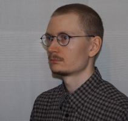

## Hi,

 My name is Tahvo Havia and I'm an undergraduate language technology student at the University of Helsinki. This web page documents things I've worked on, including some university courses. 

Even though this page is now mostly about linguistics, my Bachelor's degree will be a BSc in mathematics, due to courses already taken. I have work history in building measurement instruments, thanks to a job I got when I was fresh out of watchmaking school. (Yes, yet another academic garden path.)

## Find me on

[LinkedIn](https://www.linkedin.com/in/tahvo-havia-87404994), [GitHub](https://github.com/ant1passive)

## Contact & CV

My email address is of the form firstname.lastname@helsinki.fi. 

You can find my CV [here.](assets/documents/cv-th.pdf)

## Some Courses I've Taken

[Introduction to Language Technology](https://studies.helsinki.fi/courses/cur/hy-opt-cur-2122-43b8f122-8ca2-453b-addd-cbfd756c3306/Introduction_to_Language_Technology_Lectures), fall 2020

[Command-Line Tools for Linguists](https://studies.helsinki.fi/courses/cur/hy-opt-cur-2122-261401a1-c550-4436-91b9-7edf4a1a3b57/Command_Line_Tools_for_Linguists_exercise_session_Lectures), fall 2021

## Projects

[The one involving this webpage](https://github.com/ant1passive/ant1passive.github.io)

## Misc.

University of Helsinki has [a blog](https://blogs.helsinki.fi/language-technology/) on language technology.

